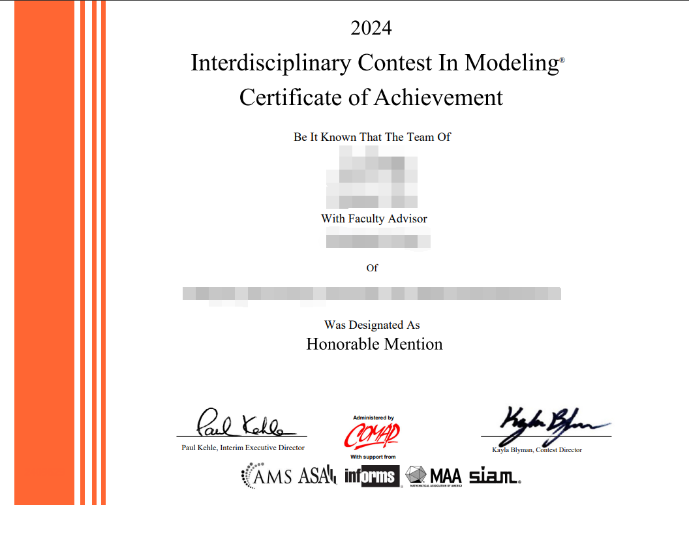

# Fuck_2024_MCM-ICM

2024 美国大学生数学建模竞赛（队号#2409529, Problem E）相关比赛资料开源仓库

致谢：三位队员 [@avidele](https://github.com/avidele) | [@dlqw](https://github.com/dlqw) | [@SUC-DriverOld](https://github.com/SUC-DriverOld)

LICENSE: [CC BY-NC-SA 4.0](https://creativecommons.org/licenses/by-nc-sa/4.0/deed.zh)

> [!NOTE]
>
> 1. 论文源码 [2409529.tex](./2409529.tex) 中的图片链接可能存在路径问题，若无法正常显示请重新手动链接。本论文中的部分图片在 [figure](./figure/) 中。
> 2. 出于某种原因，我们不提供完整的数据集表格，你可以在 [讨论文档](./Document.pdf) 中找到我们具体使用了哪些数据。

2024 年 5 月 3 日，公布的获奖证书如下：

